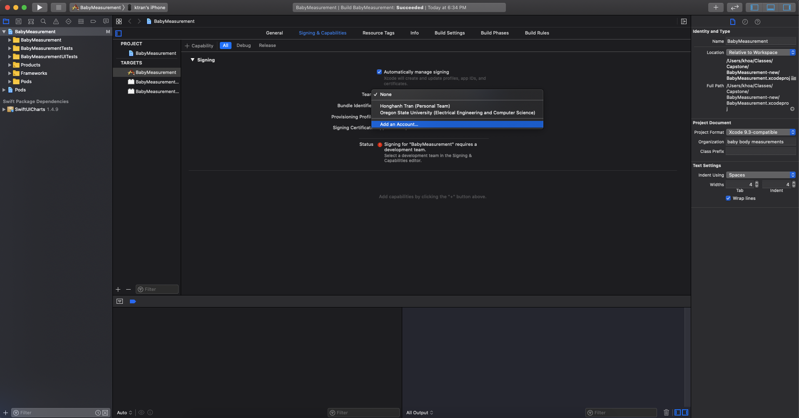
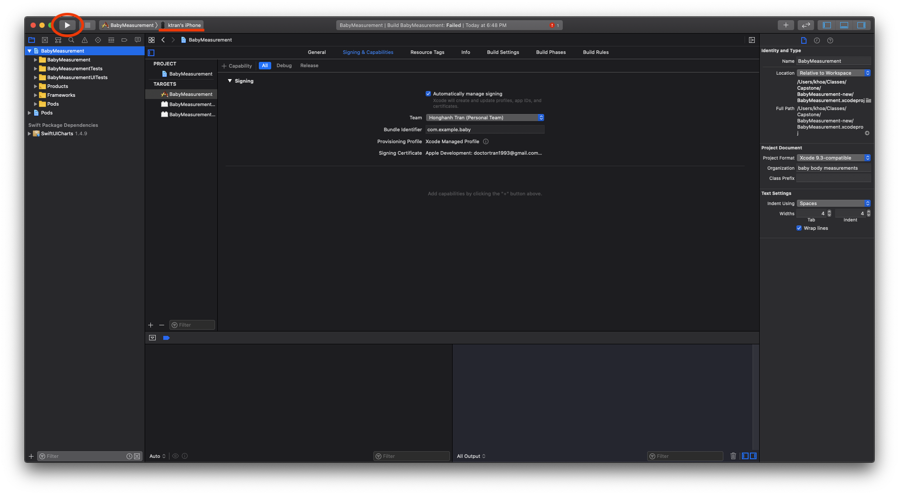
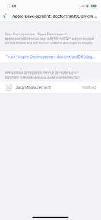

# Baby Body Measurement using Computer Vision

## Prerequisites

- Supported hardware:
  - iPhone 6s or later (**recommended**)
  - All iPad Pro models 
  - iPad 5th generation or later
- Software:
  - macOS
  - Xcode 11 or later

**NOTE**: This app was designed specifically for the iPhone.
While it can technically run on an iPad, the user interface may not adapt well to the bigger screen.

## Installation

1. Clone or download the repo
2. Open Xcode
3. When opening the project, do not do it by selecting the directory.
Instead, go inside the directory and select the workspace.

This ensures a third-party dependency is correctly imported.

4. Before you can compile and install the app onto an iPhone, you have to sign the app with a valid Apple ID.

5. Connect your iPhone to the Mac if you have not done so.
Compile and install the app by clicking on the "Run" button.
Make sure the target device is the iPhone you connected.

6. Once the app is installed, you will also need to permit the app to run on your iPhone.
Go to Settings > General > Device Management > Trust [your developer ID].

7. Rerun the app from Xcode
